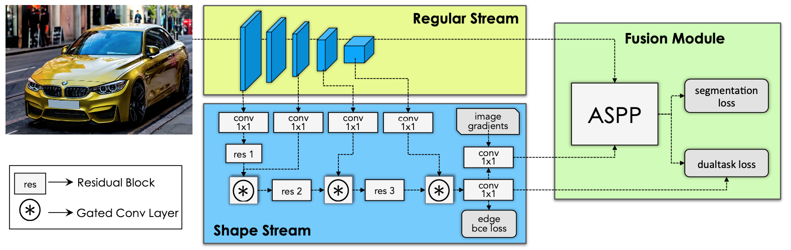
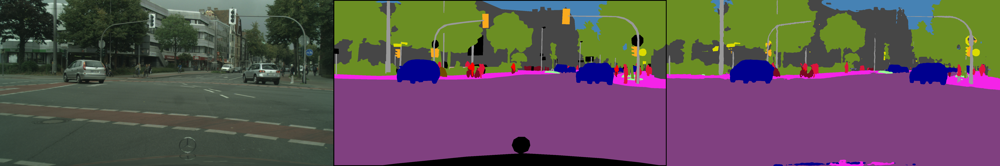

# Gated-SCNN

A PyTorch implementation of Gated-SCNN based on ICCV 2019
paper [Gated-SCNN: Gated Shape CNNs for Semantic Segmentation](https://arxiv.org/abs/1907.05740).



## Requirements

- [Anaconda](https://www.anaconda.com/download/)
- [PyTorch](https://pytorch.org)

```
conda install pytorch torchvision cudatoolkit=11.0 -c pytorch
```

- timm

```
pip install timm
```

- opencv

```
pip install opencv-python
```

- cityscapesScripts

```
pip install cityscapesscripts
```

## Usage

### Train model

```
python train.py --epochs 175 --backbone_type resnet101
optional arguments:
--data_path                   Data path for cityscapes dataset [default value is 'data']
--backbone_type               Backbone type [default value is 'resnet50'](choices=['resnet50', 'resnet101'])
--crop_h                      Crop height for training images [default value is 512]
--crop_w                      Crop width for training images [default value is 512]
--batch_size                  Number of data for each batch to train [default value is 4]
--epochs                      Number of sweeps over the dataset to train [default value is 60]
--save_path                   Save path for results [default value is 'results']
```

### Eval model

```
python viewer.py --model_weight resnet101_800_800_model.pth
optional arguments:
--data_path                   Data path for cityscapes dataset [default value is 'data']
--model_weight                Pretrained model weight [default value is 'results/resnet50_512_512_model.pth']
--input_pic                   Path to the input picture [default value is 'test/berlin/berlin_000000_000019_leftImg8bit.png']
```

## Results

The experiment is conducted on one NVIDIA TITAN RTX (24G) GPU, and there are some difference between this implementation
and official implementation:

1. `res2/res3/res4` are used in `GCLs`;
2. The non-differentiable part of `dual task loss` is not implemented;
3. The model is trained for `60 epochs` with `batch_size 4` on `512x512` images.

<table>
	<tbody>
		<!-- START TABLE -->
		<!-- TABLE HEADER -->
		<th>BackBone</th>
		<th>PA<sup>val</sup></th>
		<th>mPA<sup>val</sup></th>
		<th>Class mIOU<sup>val</sup></th>
		<th>Category mIOU<sup>val</sup></th>
		<th>Class mIOU<sup>test</sup></th>
		<th>Category mIOU<sup>test</sup></th>
		<th>FPS</th>
		<th>Download</th>
		<!-- TABLE BODY -->
		<tr>
			<td align="center">ResNet50</td>
			<td align="center">92.6</td>
			<td align="center">62.4</td>
			<td align="center">53.1</td>
			<td align="center">82.3</td>
			<td align="center">53.5</td>
			<td align="center">83.3</td>
			<td align="center">2</td>
			<td align="center"><a href="https://pan.baidu.com/s/1dJdxZ1rVC-JuOesuXo96dQ">dsjb</a></td>
		</tr>
		<tr>
			<td align="center">ResNet101</td>
			<td align="center">81.8</td>
			<td align="center">81.8</td>
			<td align="center">58.0</td>
			<td align="center">81.7</td>
			<td align="center">58.0</td>
			<td align="center">81.7</td>
			<td align="center">197</td>
			<td align="center"><a href="https://pan.baidu.com/s/1cmcAtDewYs2lWK7LaktofQ">eg6a</a></td>
		</tr>
	</tbody>
</table>

The left is the input image, the middle is ground truth segmentation, and the right is model's predicted segmentation.

### ResNet50



### ResNet101


